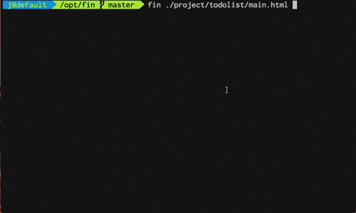

# Fin & Traveller

#### Fin 是一款终端下可以玩游戏的编辑器 -- 雏形
#### Traveller 是基于 Fin 的星际旅行游戏 -- 简单的实现

[更详细的演示视频](http://www.bilibili.com/video/av8131488/)

******

### 简要介绍 Fin & Traveller
Fin 是一款终端下可以玩游戏的编辑器。  
Fin 用 golang 开发。  
Fin 可以将 近似 HTML 文本渲染成可展示、交互的图形组件。  
Fin 使用 lua 做为脚本语言。  
Fin 以 `fin $POJECT_PATH` 的方式运行。  
Traveller 是一款基于 Fin 提供的图形界面、脚本功能开发的星际探索游戏，运行 Traveller 相应命令为:  
`fin $TRAVELLER_PATH`。    

### 如何编译运行
step1: 安装 golang。  
step2: cd $FIN_PATH。  
step3: . ./env.sh #导入用于编译环境变量，并生成 ./src/* 文件夹。  
step4: make build_fin #编译 Fin。  
step5: make install #Fin 运行项目时用到的基本库需要被放置到 $HOME/.fin 中。  
step6: ./bin/fin ./project/traveller。  
step7: have fun :)  

### 关于第三方库
Fin 源码中直接拷贝第三方库到 3rdlib 文件夹中，在 Fin 的开发过程中，根据需要对第三方库做了一定的定制，未来考虑做相应解释。  
Fin 使用了以下第三方库:  
1: golang.org/x/net/html  
2: github.com/gizak/termui  
3: github.com/layeh/gopher-json  
4: github.com/maruel/panicparse  
5: github.com/mattn/go-sqlite3 github.com/mattn/go-sqlite3/go-runewidth  
6: github.com/mitchellh/go-wordwrap  
7: github.com/nsf/termbox-go github.com/nsf/tulib  
8: github.com/satori/go.uuid  
9: github.com/stretchr/testify  
10: github.com/yuin/gopher-lua  

******

 

## Traveller
1. [故事背景](#故事背景)  
2. [交互模式](#交互模式)  
3. [控制终端命令](#控制终端命令)  
4. [操作对象](#操作对象)  
   4-1.    [大脑](#大脑)  
   4-2.    [飞船](#飞船)  
   4-3.    [星球](#星球)  
   4-4.    [机器人](#机器人)  
   4-4.    [能源站](#能源站)  
   4-6.    [死星](#死星)  

### 故事背景

公元8742年，太阳系遭遇毁灭性的打击，人类组建南极舰队逃离地球。  

公元27192年，南极舰队发生政变，通过惨烈的改革，实现了生命改良计划：人类自我机械化改造。残存的人本主义者逃离舰队，自此人类形成两大分支，基于机械结构的新人类和保留传统生物特征的人类。  

新人类无法改变对故乡—地球的怀念，于是开始了不断探索的旅途。  

公元32182年，新人类到达双子座星系，开始探索星系并尝试建立殖民地。  

Traveller，旅行者是一个 Roguelike 游戏。   
Traveller 基于 Fin 开发，玩家可以很方便地为 Traveller 编写游戏脚本，改变游戏。  

在游戏中玩家将以命令行方式操控新人类，毕竟新人类也是一台(超级)计算机。  
新人类直接使用无线通讯控制飞船或其他设备，新人类之间的交流也直接使用无线通讯。  

### 交互模式
Traveller 主要以终端命令行为交互方式。  
界面交互过程中分为一般模式和组件激活操作模式。  
一般模式下，可选择激活组件，按 'Esc' 键可以退出组件激活操作模式到一般模式。  
移动到组件下按 'Enter' 键可激活并开始操作组件。Traveller 跟随 vim 的操作方式，上下左右键分别为 ‘h‘ ’j‘ ’k‘ ’l‘，输入数字后再次输入方向键可快速跳跃。  
在终端命令行中按上下键可以切换历史命令。  

 

### 控制终端命令
| 命令           | 详细                                       |
| ------------ | ---------------------------------------- |
| /            | 进入开始模式                                   |
| tab          | tab main 或 tab planet 进入主页或星球详细页面 （需进入星球后，tab planet 才有效） |
| clear        | 清空命令行                                    |
| clearhistory | 清空历史命令                                   |
| quit         | 退出 fin                                   |

 

### 操作对象  

#### 大脑  
大脑是新人类的控制中心， 新人类通过大脑连接、控制可操作对象。  

#### 飞船
新人类驾驶飞船探索宇宙。  

| 命令         | 参数                                     | 详细                                       |
| ---------- | -------------------------------------- | ---------------------------------------- |
| /spaceship |                                        | 连接并控制飞船                                  |
| info       |                                        | 查看飞船详细信息                                 |
| speed      | $SPEED $SPEED 为数字，表示飞船 x , y 方向速度 | 改变飞船 x ,y 速度为指定值。 当飞船 x, y 方向速度均小于 0.2 时， 飞船飞过星球时将会被星球捕获，并速度为零。 改变速度时飞船燃料将减少相应速度改变量。 |
| speedx     | $SPEEDX $SPEEDX 为数字，表示飞船 x 方向速度   | 改变飞船 x 方向速度为指定值。                         |
| speedy     | $SPEEDY $SPEEDY 为数字，表示飞船 y 方向速度   | 改变飞船 y 方向速度为指定值。                         |
| jump       | $X $Y $X 为 x 坐标。 $Y 为 y 坐标。  | 启动跳跃者，飞船将瞬间跳跃到指定坐标。                      |
| landing    |                                        | 飞船将登陆其所在坐标的星球。                           |

#### 星球
飞船坐标与星球处于同一坐标时，飞船可以停落星球。  
当飞船 x, y 方向速度均小于 0.2 时，飞船飞过星球时将会被星球捕获，并速度为零。  
星球上的资源分为未开发资源和已开发资源，已开发资源可用于建造建筑物。  
飞船停落星球后可令机器人登录星球，从而挖矿、建造建筑物，目前支持：能源站、死星。  

| 命令      | 参数                                       | 详细         |
| ------- | ---------------------------------------- | ---------- |
| /planet | [$X $Y]  该两项为可选项 不输入则表示飞船登录星球。 输入可访问相应星球并查看详情。 仅可访问雷达上显示的星球。 $X 为x坐标 $Y 为x坐标  | 访问星球。      |
| info    |                                          | 显示星球详细信息。  |
| rename  | $NAME 需要重命名的名称。                     | 重命名星球名称。   |
| detail  |                                          | 进入星球的详细页面。 |

#### 机器人
新人类通过连接并控制机器人完成各种任务。  
目前机器人只有 “工程师” 型号。

| 命令                 | 参数                                       | 详细                                       |
| ------------------ | ---------------------------------------- | ---------------------------------------- |
| /robot             | $ROBOT_SERVICE_ADDRESS    $ROBOT_SERVICE_ADDRESS 为字符串 表示机器人接受连接的地址。  譬如输入 /robot a1 | 连接并控制机器人 。  初始化 Traveller 后， 会为玩家自动生成两个机器人：黄鹂、大象。 连接地址分别为 a1 a2。 |
| info               |                                          | 显示机器人详细信息。                               |
| landing            |                                          | 登录星球， 机器人只有登录星球后才能工作。               |
| aboard             |                                          | 返回飞船。                                    |
| mine               |                                          | 挖矿，该操作将开发星球上的资源， 已开发的资源可用于建造建筑物。    |
| cleanjob           |                                          | 清空所有任务                                   |
| build              | $BUILDING_TYPE $BUILDING_TYPE 为字符串，表示建筑物类型。 目前可建造建筑物为能源站、死星 | 建造建筑物。                              |
| destroy            | $BUILDING_TYPE $BUILDING_TYPE 为字符串，表示建筑物类型。 | 毁灭建筑物。                                   |
| collect resource   | $NUMBER $NUMBER 为数字，表示要收集的资源数量。     | 从星球上收集已开发的资源到飞船上。                        |
| transport resource | $NUMBER $NUMBER 为数字，表示要运输的资源数量。     | 把飞船上的资源运输到星球上。                           |

#### 能源站
能源站可用于给飞船补给能源。  
能源站建造耗费 1 资源。  

| 命令                   | 参数   | 详细                                 |
| -------------------- | ---- | ---------------------------------- |
| /building PowerPlant |      | 连接能源站。                             |
| recharge             |      | 给飞船充电。 飞船只有停落在能源站所在星球，才能进行充电。 |

#### 死星
死星可用于给飞船补给能源。
死星建造耗费 2 资源。  

| 命令                  | 参数                                    | 详细                  |
| ------------------- | ------------------------------------- | ------------------- |
| /building DeathStar |                                       | 连接死星。               |
| destroy             | $X $Y $X 为 x 坐标。 $Y 为 y 坐标。 | 输入雷达上星球的坐标，可毁灭相应星球。 |